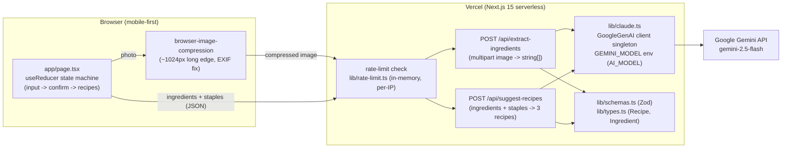

# ARCHITECTURE.md — FridgeChef (SPEC-01)

Governing document for all 8 tasks in `docs/specs/SPEC-01-fridgechef.md`.
Everything here is derived from SPEC-01. Decisions the SPEC left open are documented as ADRs and flagged **"assumed because SPEC did not specify — human should review"**.

---

## 1. System overview

FridgeChef is a stateless, mobile-first Next.js 15 (App Router) web app deployed on Vercel. Users provide ingredients by typing or photographing their fridge; the client calls two server-side route handlers which invoke the Google Gemini API (`gemini-2.5-flash` via the `@google/genai` SDK) and return 3 structured recipes. There are no accounts, no database, and no persistence of any kind. The system boundary is: browser client ↔ two Next.js route handlers ↔ Gemini API. Nothing else. The previous provider, Anthropic Claude, remains available as a fully commented-out fallback in `lib/claude.ts` for an easy manual revert (see ADR-011).



### Module layout

```
app/
  layout.tsx              # root layout, globals.css import
  globals.css             # Tailwind
  page.tsx                # entire UI: useReducer state machine (input | confirm | recipes)
  api/
    extract-ingredients/route.ts   # POST — image → ingredient list
    suggest-recipes/route.ts       # POST — ingredients + staples → 3 recipes
middleware.ts             # per-IP rate limit on /api/* (Task 8; see ADR-005 for placement)
lib/
  claude.ts               # GoogleGenAI client singleton + AI_MODEL constant (sole env access for model/key); Anthropic client preserved commented-out as revert path
  types.ts                # Recipe, Ingredient domain types — no UI/stateful concerns
  schemas.ts              # Zod schemas: request bodies + LLM output validation
  rate-limit.ts           # in-memory sliding-window limiter keyed by IP
components/               # UI pieces extracted from page.tsx as needed (chips, cards, skeleton)
```

Rule: `lib/types.ts` and `lib/schemas.ts` are pure — no React, no Next imports — so SPEC-02's DB layer can consume them unchanged.

---

## 2. API contract

- **Versioning**: none — routes are `/api/extract-ingredients` and `/api/suggest-recipes` exactly as SPEC-01 defines them. The SPEC explicitly names these paths; introducing `/api/v1/` would contradict the approved SPEC (see ADR-001).
- **Auth**: none. Both routes are public, guarded only by rate limiting. No auth headers.
- **Error format** (every non-2xx response, both routes):

```json
{
  "error": "<machine_code>",
  "message": "<human-readable detail>"
}
```

  Machine codes: `invalid_request` (400), `file_too_large` (413), `unsupported_media_type` (415), `rate_limited` (429, plus `Retry-After` header, body may omit `message`), `llm_error` (502 — LLM call failed or output failed Zod validation), `internal_error` (500).

### Endpoints

| Method | Path | Auth | Request | Response (200) | Description |
|---|---|---|---|---|---|
| POST | `/api/extract-ingredients` | none (rate-limited) | `multipart/form-data`, field `image`: jpeg/png/webp, ≤ 5 MB | `{ "ingredients": string[] }` | Sends image to the LLM (vision), returns detected ingredient names |
| POST | `/api/suggest-recipes` | none (rate-limited) | JSON `{ "ingredients": string[], "pantryStaples": string[] }` | `{ "recipes": Recipe[] }` — exactly 3 | Generates 3 structured recipes; `missingIngredients` excludes anything in `pantryStaples` |

Request bodies are validated with Zod at the route-handler entry point (the only validation site — see §11). Empty `ingredients` array → 400 `invalid_request`.

---

## 3. Data architecture

**N/A — SPEC-01 explicitly excludes all persistence**: no database, no localStorage, no cookies, no server-side storage. Consequently:

- Migrations: N/A — no schema exists.
- Connection pooling: N/A — no database connections.
- Pagination: N/A — the only list responses are a fixed 3-recipe array and a short ingredient array; both are bounded by construction.

### Domain types (in-memory only, `lib/types.ts`)

```ts
type Difficulty = "easy" | "medium" | "hard";

interface Recipe {
  name: string;
  cuisine: string;
  usedIngredients: string[];
  missingIngredients: string[];   // never contains a pantryStaples entry
  cookTimeMinutes: number;
  difficulty: Difficulty;
  steps: string[];
}

// Ingredient is a plain string alias in v1 (type Ingredient = string).
// Kept as a named type so SPEC-02 can widen it to an object (id, quantity, …)
// without touching call sites that only pass names.
```

Zod schemas in `lib/schemas.ts` mirror these exactly and are the single source of truth for validating LLM output. `Recipe[]` is validated as `z.array(recipeSchema).length(3)`.

Ephemeral data rule (SPEC constraint): uploaded image Buffers live only in the route handler's scope, are never written to disk, never logged, and are eligible for GC as soon as the response is sent. Ingredient lists are likewise never logged.

---

## 4. Auth and authorization

**N/A — SPEC-01 states "Auth strategy: N/A — stateless, no user accounts."** There are no protected routes, no sessions, no tokens, no roles. All routes are public. The only access control is the per-IP rate limit (§ rate limiting, Task 8). The one active secret in the system, `GEMINI_API_KEY`, authenticates the *server* to Google, is read only inside `lib/claude.ts`, and must never appear in a client bundle (verified in build output per Definition of done). Auth arrives in SPEC-02 and is explicitly out of scope here.

---

## 5. State management (frontend)

Confirmed in SPEC-01 decisions 5 and 10:

- **Pattern**: single-page client state machine via React `useReducer` in `app/page.tsx`. Reducer state: `{ step: "input" | "confirm" | "recipes", ingredients: string[], pantryStaples: string[], recipes: Recipe[], loading: boolean, error: string | null }` (exact shape finalised in Task 5; step union is SPEC-mandated).
- **No external store** (no Zustand/Redux/Jotai/TanStack Query), **no URL routing between steps**.
- Rules: all cross-step state lives in the single reducer; purely presentational state (e.g. a card's expanded/collapsed steps) stays as local `useState` in the component; there is no server cache — every "Generate/Regenerate" is a fresh API call by design (stateless app).
- Pre-selected staples: Salt, Pepper, Olive oil on; Butter, Garlic, Common spices off (SPEC decision 2).

---

## 6. Infrastructure and environments

- **Environments**: local dev (`npm run dev`, Node 20 LTS) and Vercel production. No staging environment — SPEC-01 defines only local + Vercel deploy (Task 7); Vercel preview deployments come for free with the platform and use the same env vars as production (ADR-002).
- **Environment variables** (keys only):
  - `GEMINI_API_KEY` — required, server-only, both environments. Never `NEXT_PUBLIC_`.
  - `GEMINI_MODEL` — optional, defaults to `gemini-2.5-flash` in `lib/claude.ts` (exported as `AI_MODEL`).
  - `ANTHROPIC_API_KEY` / `CLAUDE_MODEL` — **not currently required.** They remain documented in `.env.local.example` and README for the commented-out Anthropic fallback path in `lib/claude.ts` (ADR-011); nothing reads them while Gemini is the active provider.
- **Central config rule**: LLM env vars are read **only** in `lib/claude.ts`. No other file touches `process.env` for these. Any future env var gets a similar single access point.
- **Statelessness**: fully satisfied by design — no sessions to store, no file uploads persisted (images are in-memory Buffers only, discarded post-response). No object storage needed because nothing is stored.

---

## 7. External dependencies

Exactly one **active** external service. (SPEC-01 said "Anthropic Claude API only"; the active provider was swapped to Google Gemini post-approval at the user's explicit request — see ADR-011. The one-LLM-provider constraint itself still holds.)

| Service | Purpose | Fallback if down | Timeout | Retry policy |
|---|---|---|---|---|
| Google Gemini API (`gemini-2.5-flash` via `@google/genai`) | Ingredient extraction from images (vision) and 3-recipe JSON generation | None — return 502 `llm_error`; UI shows an error state with a "Try again" action. No cached/canned recipes (would contradict statelessness). | 15 s per call (`httpOptions.timeout: 15000`; see ADR-012 — Gemini enforces a 10 s minimum deadline, ADR-003's original 8 s assumption was below this floor) | None configured beyond SDK defaults. **No** application-level retry on bad JSON — invalid LLM output → immediate 502 (ADR-003). |

`@anthropic-ai/sdk` remains in `package.json` and the Anthropic client remains in `lib/claude.ts` — but **commented out**: it is a documented, code-level revert path, **not** a runtime fallback. The app never fails over to it automatically (ADR-011).

Vercel and npm packages (zod, browser-image-compression, Tailwind, Vitest, Playwright) are platform/build dependencies, not runtime external services.

---

## 8. Async jobs

**N/A — no job queue.** The only slow operations are the two LLM calls (~2–6 s, SPEC constraint), and they intentionally run inline within the HTTP request because the client is synchronously waiting for the result — this is a request/response product, not background work. Handling of the slowness:

- Client shows a loading/skeleton state for the duration of both calls (SPEC-mandated; Tasks 4–6).
- The 15 s LLM timeout (ADR-012, correcting ADR-003's original 8 s value) keeps requests within the routes' Vercel serverless function budget (`maxDuration = 20` on both routes — 5 s of headroom beyond the SDK timeout, safely under Vercel Hobby's real 60 s ceiling).
- No emails, file processing, PDF generation, or external syncs exist in SPEC-01, so no queue, retry counts, DLQ, or alerting are needed. If SPEC-02+ adds background work, this section gets a real queue and a new ADR.

---

## 9. Caching strategy

Deliberately minimal — the app is stateless and every LLM response should be fresh (users expect "Regenerate" to produce new recipes).

| What | Where | TTL | Invalidation |
|---|---|---|---|
| API route responses (`/api/*`) | Not cached — `Cache-Control: no-store` on both routes | n/a | n/a |
| Static assets (JS/CSS/fonts) | Vercel CDN (Next.js defaults: immutable hashed assets) | Framework default (1 year, content-hashed) | New deploy = new hashes |
| Landing page HTML | Vercel CDN via Next.js static/ISR defaults | Framework default | New deploy |
| DB query cache | N/A — no database | — | — |

No application-layer cache (no Redis, no LRU on LLM responses). ADR-004 records this.

---

## 10. Observability

- **Error tracking**: Vercel's built-in function logs and error reporting only — no third-party tracker (Sentry etc.) in v1 (ADR-006; assumed, human should review).
- **Metrics**: Vercel Analytics/function metrics provide response times and error rates per route. Watch: route p50/p95 latency (expect 2–6 s, LLM-bound), 429 rate (rate-limiter pressure), 502 rate (LLM/Zod failures).
- **Tracing**: N/A — a two-route monolith calling one external API has nothing to trace across.
- **Structured logging**: route handlers log one JSON line per request via a tiny helper:

```json
{ "timestamp": "ISO-8601", "level": "info|warn|error", "event": "extract_ingredients|suggest_recipes|rate_limited|llm_error", "requestId": "<crypto.randomUUID() per request>", "status": 200, "durationMs": 3120 }
```

  `userId` is permanently absent — there are no users.
- **PII exclusion (SPEC-mandated, stricter than usual)**: never log image Buffers/base64, ingredient lists, recipe contents, the API key, or full raw IPs. The rate limiter keys on IP in memory but logs at most a truncated/hashed form on 429 events. Enforced in code review and by security-agent.

---

## 11. Security baseline

- **CORS**: same-origin only. No CORS headers are added to `/api/*` — the API exists solely for the app's own frontend on the same origin, in every environment. Any cross-origin browser call is rejected by default (ADR-007).
- **Rate limiting**: `lib/rate-limit.ts`, in-memory sliding-window keyed by client IP (`x-forwarded-for`, first hop — trustworthy on Vercel). Limit: **5 recipe generations per hour per IP**, guarding both `/api/extract-ingredients` and `/api/suggest-recipes` as a shared budget (both spend LLM tokens; see ADR-005 for the shared-vs-separate decision). Exceeding → `429 { "error": "rate_limited" }` + `Retry-After` (seconds until window frees). Known ceiling, stated in SPEC: state is per-serverless-instance and resets on cold start — best-effort throttling of casual abuse, not durable. A `// ponytail:` comment in the code names this ceiling and the SPEC-05 Upstash upgrade path.
- **Input validation**: Zod, at route-handler entry points **only** — never inside `lib/claude.ts` or other helpers. Three validation sites: (1) `suggest-recipes` request body, (2) `extract-ingredients` upload (size ≤ 5 MB via `Content-Length` + actual Buffer length; MIME ∈ {image/jpeg, image/png, image/webp} checked on the file's declared type), (3) LLM JSON output from both routes (trust boundary: the LLM is untrusted input).
- **Security headers** (set in `next.config.ts` headers()):
  - `X-Frame-Options: DENY`
  - `X-Content-Type-Options: nosniff`
  - `Referrer-Policy: strict-origin-when-cross-origin`
  - `Content-Security-Policy: default-src 'self'; img-src 'self' data: blob:; script-src 'self' 'unsafe-inline'; style-src 'self' 'unsafe-inline'; connect-src 'self'` — `blob:`/`data:` needed for client-side image preview/compression; `'unsafe-inline'` is the pragmatic Next.js baseline (ADR-008; assumed, human should review if a stricter nonce-based CSP is wanted).
- **HTTPS / canonical URL**: Vercel enforces HTTPS and http→https redirect platform-side. Canonical host is the bare Vercel-assigned domain; no www variant exists in v1. No custom domain is in SPEC-01 scope.
- **Secret hygiene** (SPEC-mandated): `GEMINI_API_KEY` server-side only, accessed solely in `lib/claude.ts`; Definition of done requires verifying its absence from the client bundle. (Same rule applies to `ANTHROPIC_API_KEY` if the commented fallback is ever reactivated.)

---

## 12. Performance baseline

From SPEC-01 (which sets no hard SLA); items the SPEC omitted use conservative defaults (ADR-009):

- **LLM latency**: ~2–6 s per generation, LLM-bound. No hard SLA. Loading/skeleton state required on every LLM-backed transition (SPEC-mandated).
- **Image handling (SPEC-mandated)**: client-side downscale to ~1024px long edge via `browser-image-compression` (also corrects EXIF rotation) before base64 encoding; server rejects > 5 MB and non-{jpeg,png,webp}.
- **Core Web Vitals targets** (defaults — SPEC did not specify): LCP ≤ 2.5 s, INP ≤ 200 ms, CLS ≤ 0.1 on the landing page over mobile 4G.
- **JS bundle limit** (default — SPEC did not specify): ≤ 200 KB gzipped first-load JS for `app/page.tsx`. `browser-image-compression` is dynamically imported only when the user picks photo mode, so text-mode users never download it.
- **UI images**: the app ships essentially no static imagery (mobile-first, chip/card UI); any icons are inline SVG. User-uploaded previews use object URLs, `loading="lazy"` where offscreen.
- **Pagination / N+1**: N/A — no database and no unbounded lists (3 recipes, short ingredient arrays). The no-query-in-a-loop rule applies trivially: there is exactly one LLM call per request, never in a loop.

---

## 13. Feature flags and rollout

**None — SPEC-01: "Feature flag strategy: none."** No flag library, no percentage rollouts. Rollout mechanism for all 8 tasks is the SPEC's own git flow: each feature lands on `main` only after the test → security → review gates pass, and Vercel deploys `main`. Vercel preview deployments serve as the "dark deploy" check before merge when needed. Risky-change rollout beyond this is out of scope until the app has users and state (SPEC-02+).

---

## 14. Rollback strategy

- **Code rollback**: two equivalent levers — (a) Vercel "Instant Rollback" to the previous production deployment (fastest, zero git churn), or (b) `git revert <merge-commit>` on `main`, which triggers a fresh deploy. Prefer (a) for immediate mitigation, then (b) to make the tree match production. Every merge to `main` is an independently deployable, gate-approved state, so any prior deployment is a valid rollback target.
- **Database rollback**: N/A — no database, no migrations, nothing to roll back. (The blanket up/down-migration rule activates in SPEC-02 when a DB appears.)
- **Communication**: single-maintainer project — the human operator (repo owner) performs and is inherently aware of any rollback; the orchestrator records it in `AGENT_LOG.md`. No external stakeholders or on-call rotation exist.

---

## 15. Architecture Decision Records

### ADR-001: No API version prefix
**Date**: 2026-07-03
**Status**: Accepted
**Context**: House convention defaults to `/api/v1/...`, but SPEC-01 explicitly names the routes `POST /api/extract-ingredients` and `POST /api/suggest-recipes`, and the Playwright E2E specs and tasks reference those exact paths.
**Options considered**: (1) `/api/v1/` prefix per convention; (2) SPEC-verbatim paths.
**Decision**: SPEC-verbatim paths. The SPEC is user-approved and unambiguous.
**Consequences**: A future breaking API change would need `/api/v2/` alongside — acceptable for a 2-route app. Zero risk of drift between SPEC, tests, and code today.

### ADR-002: Two environments only (local + Vercel production)
**Date**: 2026-07-03
**Status**: Accepted
**Context**: SPEC-01 defines local development and a Vercel deploy (Task 7); it never mentions staging. *Assumed because SPEC did not specify — human should review.*
**Options considered**: (1) dev/staging/prod triple; (2) dev + prod, with Vercel's automatic preview deployments filling the pre-prod-check role.
**Decision**: Option 2. A stateless app with no DB has nothing that a staging environment would isolate.
**Consequences**: Simpler env-var management (one production set). Preview deployments consume the same `ANTHROPIC_API_KEY` — acceptable given the rate limiter and low traffic; revisit in SPEC-05.

### ADR-003: Vercel Hobby plan — 10s function limit
**Date**: 2026-07-03
**Status**: Accepted
**Context**: The deploy target is Vercel Hobby (free tier). Serverless function limit is 10s — the previous 30s SDK timeout and one-retry design would be killed by Vercel before executing.
**Decision**: SDK timeout set to 8s (leaves ~2s for network overhead and Zod parsing). No retry on bad JSON — if Claude returns invalid JSON, return a structured error immediately. Both route handlers must export: `export const maxDuration = 10`
**Rationale**: Haiku 4.5 typically responds in 1-3s. 8s covers edge cases without hitting the Vercel ceiling.
**Consequences**: Upgrade path: moving to Vercel Pro unlocks 60s maxDuration — restore retry logic at that point (SPEC-02 or later).

**Note (see ADR-012):** the "Vercel Hobby = 10s hard limit" premise in this ADR was later found to be incorrect — Hobby supports up to 60s `maxDuration` (300s with Fluid Compute); 10s is only the default. The specific 8s/10s values here are superseded, and the 8s client timeout caused a production outage after the Gemini swap (ADR-011) because Gemini enforces a 10s minimum deadline. See ADR-012 for the corrected values. The no-retry-on-bad-JSON decision remains in force.

### ADR-004: No application-layer caching of LLM responses
**Date**: 2026-07-03
**Status**: Accepted
**Context**: Identical ingredient lists could theoretically reuse a cached recipe response to save tokens. SPEC is silent. *Assumed because SPEC did not specify — human should review.*
**Options considered**: (1) in-memory LRU keyed on sorted ingredients; (2) no cache.
**Decision**: No cache. "Regenerate" is a first-class feature — users explicitly want *different* recipes for the same inputs, so caching fights the product. Cache-hit rates across per-instance serverless memory would be negligible anyway. `Cache-Control: no-store` on both API routes.
**Consequences**: Every generation costs Anthropic tokens; the per-IP rate limit is the cost control. Easier: correctness and privacy (nothing retained). Harder: nothing.

### ADR-005: Rate limit applies to /api/suggest-recipes only
**Date**: 2026-07-03
**Status**: Accepted
**Context**: SPEC Task 8 says "applied in middleware.ts or per-route" (an explicit either/or left to architecture) and says the limit "guards both API routes" without stating whether each route gets its own 5/hour counter.
**Decision**: The 5/hour per-IP counter tracks only recipe generation calls. `/api/extract-ingredients` is exempt — it is an auxiliary step, not the protected resource.
**Rationale**: Photo users call extract + generate per attempt. Counting both would give photo users ~2 full attempts/hour vs text users' 5 — penalising FridgeChef's primary differentiator.
**Implementation**: rate-limit middleware checks route path before incrementing counter.

### ADR-006: Observability = Vercel built-ins only, no third-party error tracker
**Date**: 2026-07-03
**Status**: Accepted
**Context**: SPEC-01 mentions no observability tooling. *Assumed because SPEC did not specify — human should review.*
**Options considered**: (1) Sentry; (2) Vercel function logs + Analytics only.
**Decision**: Option 2. A 2-route, no-user, no-persistence v1 does not justify a Sentry dependency, DSN secret, and PII-scrubbing config — especially under the SPEC's strict never-log-ingredients/images rule, where a default error tracker capturing request bodies would itself be a violation.
**Consequences**: Easier: zero new deps/secrets, no accidental PII capture. Harder: no alerting/aggregation — acceptable until SPEC-02 adds users; add a tracker (with request-body scrubbing) then.

### ADR-007: Same-origin API, no CORS headers
**Date**: 2026-07-03
**Status**: Accepted
**Context**: SPEC is silent on CORS. The API serves only FridgeChef's own frontend. *Assumed because SPEC did not specify — human should review.*
**Options considered**: (1) explicit allow-list of origins; (2) emit no CORS headers at all.
**Decision**: Option 2 — the browser's same-origin default is the allow-list. Nothing to configure per environment because the frontend and API always share an origin (Next.js monolith).
**Consequences**: Third-party browser clients are blocked by default (desired — protects the Anthropic budget alongside the rate limiter). Non-browser callers (curl) are unaffected by CORS by nature; the rate limiter handles those.

### ADR-008: Pragmatic CSP with 'unsafe-inline', not nonce-based
**Date**: 2026-07-03
**Status**: Accepted
**Context**: SPEC requires no CSP; house baseline requires one. Next.js App Router needs inline scripts/styles unless a nonce pipeline is built. *Assumed because SPEC did not specify — human should review.*
**Options considered**: (1) strict nonce-based CSP via middleware (extra machinery, fights Tailwind/Next defaults); (2) static CSP allowing `'unsafe-inline'`, everything else locked to `'self'` (+ `data:`/`blob:` for image previews).
**Decision**: Option 2. The app renders no user-generated HTML and has no auth/session to steal, so XSS blast radius is minimal; a strict CSP buys little for its cost here.
**Consequences**: Weaker XSS mitigation than a nonce CSP — acceptable for v1's threat model. Revisit in SPEC-02 when sessions exist and XSS gains a payoff.

### ADR-009: Default performance numbers where SPEC gave none
**Date**: 2026-07-03
**Status**: Accepted
**Context**: SPEC-01 sets image-size and latency expectations but no Core Web Vitals or bundle-size targets. *Assumed because SPEC did not specify — human should review.*
**Options considered**: leave unspecified vs. adopt standard "good" CWV thresholds and a 200 KB gzipped first-load JS ceiling.
**Decision**: Adopt LCP ≤ 2.5 s / INP ≤ 200 ms / CLS ≤ 0.1 and ≤ 200 KB first-load JS, with `browser-image-compression` dynamically imported.
**Consequences**: review-agent has concrete numbers to check against; a mobile-first single-page app comfortably fits these. If they prove wrong, they're targets, not contracts — amend via a new ADR.

### ADR-010: Ingredient as `type Ingredient = string` in v1
**Date**: 2026-07-03
**Status**: Accepted
**Context**: SPEC Task 2 says define shared `Recipe`/`Ingredient` types but the Recipe shape uses plain `string[]` for ingredient lists, and the Notes require types clean of UI/stateful concerns for SPEC-02.
**Options considered**: (1) object type `{ name: string }` now for forward compatibility; (2) named string alias.
**Decision**: Named alias `type Ingredient = string`. The v1 domain genuinely has no ingredient attributes; an object wrapper would be speculative structure (YAGNI). The named alias still gives SPEC-02 a single widening point.
**Consequences**: Zero ceremony now; SPEC-02 widens the alias and follows compiler errors to every touch point.

### ADR-011: Swap active LLM provider from Anthropic Claude to Google Gemini
**Date**: 2026-07-04
**Status**: Accepted
**Context**: FridgeChef is a personal demo project. The user explicitly requested moving off the paid Anthropic API onto Google Gemini's free tier (AI Studio) to eliminate LLM cost. The swap was implemented, tested, security-scanned, review-approved, and merged to `main`; this ADR documents the shipped decision.
**Options considered**: (1) stay on Anthropic Claude (paid); (2) swap to Gemini as the sole active provider, keeping the Anthropic client commented out in `lib/claude.ts` as a manual revert path; (3) build a provider-agnostic LLM abstraction supporting both.
**Decision**: Option 2. `lib/claude.ts` now exports `AI_MODEL` (`GEMINI_MODEL` env, default `gemini-2.5-flash`) and a `GoogleGenAI` singleton (`@google/genai`, pinned 2.10.0) with `httpOptions.timeout: 8000` — the same 8 s budget ADR-003 mandated for the Anthropic SDK's timeout option. Both route handlers call `genAI.models.generateContent(...)` with `responseMimeType: "application/json"` and read `response.text`; the vision route uses `createPartFromBase64`. Option 3 was rejected as speculative generalization: a single-maintainer personal project runs exactly one provider at a time, and an abstraction layer would be maintained for zero active consumers. `@anthropic-ai/sdk` stays installed so reverting requires no `npm install`.
**Consequences**: Reverting to Anthropic is a manual, deliberate action — uncomment the client block in `lib/claude.ts` and restore the Anthropic call shape in both route files — not a runtime toggle or automatic failover. Error contract, Zod validation, `maxDuration = 10`, no-store caching, structured logging, and PII exclusion are unchanged. Gemini free-tier rate/quota limits (Google AI Studio) are the operator's responsibility to monitor — the app's per-IP rate limiter (ADR-005) now protects the Gemini quota rather than the Anthropic budget. Easier: zero LLM cost. Harder: free-tier quotas may throttle under load, and ADR-003's latency rationale (Haiku response times) now applies analogously to `gemini-2.5-flash` rather than exactly.

### ADR-012: Correct Vercel Hobby duration ceiling and fix Gemini timeout/thinking-token bugs
**Date**: 2026-07-04
**Status**: Accepted
**Context**: ADR-003 was premised on Vercel Hobby having a hard 10 s serverless function limit. That premise is factually wrong: verified against current official Vercel documentation, Hobby's *default* `maxDuration` is 10 s but it is explicitly configurable up to **60 s** (up to 300 s on Fluid Compute-enabled projects). The mistaken ceiling forced an 8 s SDK client timeout, which caused a real production outage after the Gemini swap (ADR-011): Gemini's API enforces a hard **minimum 10 s call deadline**, so the 8 s client deadline was rejected outright on every call with 400 `INVALID_ARGUMENT` ("Manually set deadline 8s is too short. Minimum allowed deadline is 10s") — both API routes failed 100% of the time. The fix shipped through the full gate pipeline (task → test → security → review) and is merged to `main`; this ADR documents it.
**Options considered**: (1) keep the 8 s/10 s values and find a workaround (e.g. omit the client deadline entirely) — rejected: it preserves a false premise and loses explicit timeout control; (2) correct the ceiling assumption and raise both values — chosen; there was no real debate, this is a factual correction.
**Decision**: In `lib/claude.ts`, raise `httpOptions.timeout` from `8000` to `15000` (15 s — comfortably above Gemini's 10 s floor). In both route handlers (`app/api/suggest-recipes/route.ts`, `app/api/extract-ingredients/route.ts`), raise `export const maxDuration` from `10` to `20` (5 s of headroom beyond the SDK timeout for JSON parsing, Zod validation, and network overhead — safely within Hobby's real 60 s ceiling). The same fix also added `thinkingConfig: { thinkingBudget: 0 }` to both routes' `generateContent` config — a **separate, unrelated bug** fixed in the same commit: `gemini-2.5-flash` by default spends `maxOutputTokens` budget on internal reasoning tokens, which was silently truncating the JSON output. That is an output-budget issue, not a timeout/duration issue — two distinct root causes fixed together.
**Consequences**: Both API routes work again (previously 100% failure). Hobby's real ceiling (60 s / 300 s with Fluid Compute) leaves ample further headroom if timeouts ever need raising again — ADR-003's "upgrade to Pro to unlock 60s" upgrade path is moot. With thinking disabled, Gemini's full output-token budget goes to actual JSON instead of invisible reasoning, making responses more complete and reliable beyond just fixing the deadline error. ADR-003's specific 8 s/10 s numbers are superseded (see note appended there); its no-retry-on-bad-JSON decision and ADR-011's provider choice are unchanged. Trade-off accepted: a genuinely slow LLM call can now occupy a function for up to 20 s instead of 10 s — negligible at this traffic level and bounded by the 15 s SDK timeout.

---

*End of ARCHITECTURE.md — SPEC-01. Append new ADRs sequentially; never edit existing ones.*
